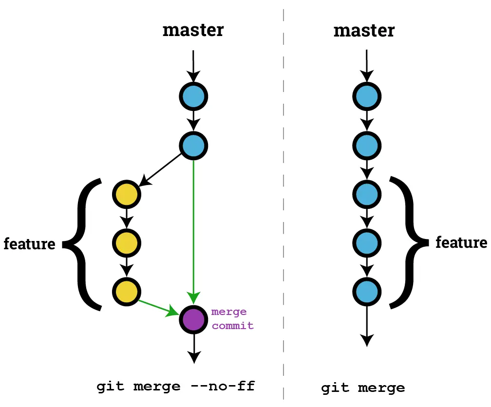
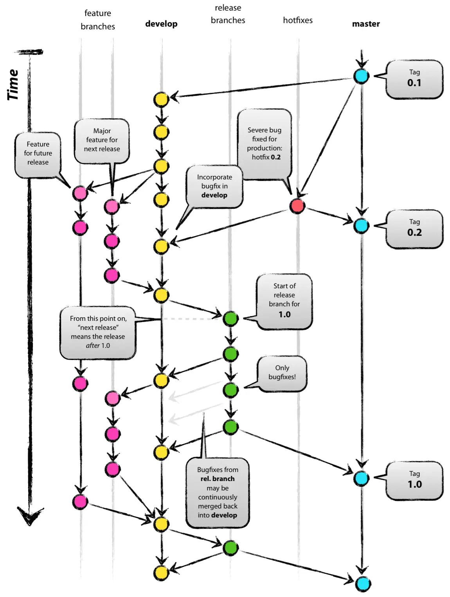
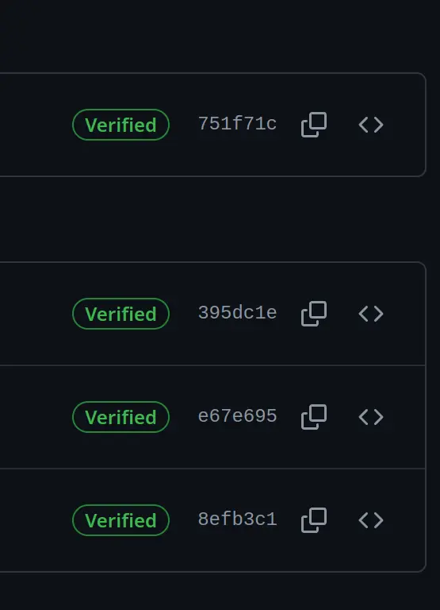

# Git 要点

## config

分全局 `~/.gitconfig` 和项目的 `.git/config`

我个人的例子 [gitconfig](https://github.com/zhengkai/conf/blob/master/dotfiles/gitconfig)

## merge `--no-ff`



## 已过时的标准模型



## git rebase

```
[pull]
	rebase = true

[rebase]
	autostash = true
```

## 裸仓库

其实 git 仓库不需要有远端 server。其实 git 仓库只分两种，裸仓库（github、gitlab 等托管的就是这种，你本地也可以建），和带工作目录的（本地正常开发时的）

## git reflog

只要进了仓库的就基本都能救回来

## 签名

其实 git commit 里的 author 是随便填的，你写谁的邮箱，就显示谁的头像

有约束力的是



以前用 GPG，略麻烦，现已增加用 ssh key 做签名

```
[user]
	signingKey = /home/zhengkai/.ssh/id_ecdsa.pub

[commit]
	gpgsign = true
```
